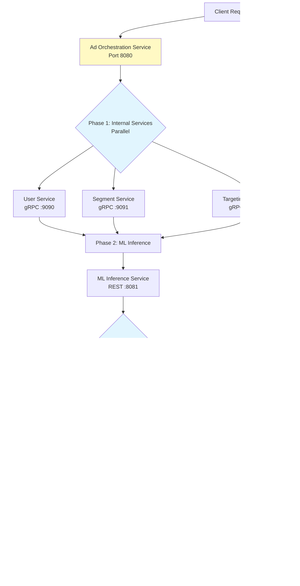

# AdServe - High-Performance Ad Serving Platform

Real-time bidding (RTB) platform demonstrating modern Java structured concurrency with Virtual Threads and `StructuredTaskScope`.

## Overview

AdServe orchestrates parallel service calls, real-time ML predictions, and demand partner bidding to serve targeted advertisements. It showcases Java's Virtual Threads and `StructuredTaskScope` (preview) for structured, timeout-controlled concurrency in a microservices architecture.

**Key highlights:**
- Structured concurrency with Virtual Threads and `StructuredTaskScope`
- Spring Framework native resilience (`@Retryable`, `@ConcurrencyLimit`)
- HTTP Service Registry with `@ImportHttpServices` for declarative HTTP client management
- gRPC for internal service communication, OpenRTB 2.6 for partner bidding
- Prometheus + Grafana observability

## Architecture



## Request Flow

| Phase | Description | Execution |
|-------|-------------|-----------|
| **1. Internal Services** | Fetch user profile, segments, and targeting rules | Parallel gRPC calls via `StructuredTaskScope` (fail-fast) |
| **2. ML Prediction** | Predict CTR/CVR using request context and segments | Sequential REST call |
| **3. Partner Bidding** | Collect bids from demand partners using OpenRTB 2.6 | Parallel REST calls via `StructuredTaskScope` (partial results accepted) |
| **4. Auction** | Select highest bid (first-price auction) | In-memory comparison |
| **5. Response** | Return winning ad with metadata to client | JSON response |

## Technology Stack

| Component | Technology | Purpose |
|-----------|------------|---------|
| Language | Java (preview features enabled) | Virtual Threads, `StructuredTaskScope` |
| Framework | Spring Boot / Spring Framework | REST API, dependency injection, resilience |
| Build | Gradle (Kotlin DSL) | Multi-module project management |
| Internal RPC | gRPC + Protocol Buffers | High-performance service-to-service communication |
| HTTP Clients | Spring HTTP Service Registry (`@ImportHttpServices`) | Declarative HTTP client proxies grouped by service |
| RTB Protocol | OpenRTB 2.6 | Industry-standard bid request/response format |
| Resilience | Spring native (`@Retryable`, `@ConcurrencyLimit`) | Retry, concurrency limiting on method invocations |
| Monitoring | Prometheus + Grafana | Metrics collection and dashboards |
| Runtime | ZGC (Generational) | Low-latency garbage collection |

## Services

### ad-orchestration (port 8080) - Main Service

The central orchestrator and the service we own. Receives ad requests, coordinates all backend calls using structured concurrency, runs the auction, and returns the winning ad. Key design decisions:

- **Structured concurrency**: Phase 1 (internal services) uses `awaitAllSuccessfulOrThrow` - if any internal service fails, the entire scope fails fast. Phase 3 (partner bidding) uses `allSuccessfulOrThrow` with timeout tolerance - partial bid results are accepted.
- **HTTP Service Registry**: Partner and ML clients are declared as `@HttpExchange` interfaces, organized into groups via `@ImportHttpServices`, and configured through a single `RestClientHttpServiceGroupConfigurer`. The underlying `HttpClient` uses a Virtual Thread executor.
- **Timeout strategy**: HTTP connect/read timeouts are configured to be shorter than the `StructuredTaskScope` timeout. This ensures `scope.close()` does not block waiting for HTTP calls, which would cause latency spikes.
- **Resilience**: Spring Framework native `@Retryable` on HTTP service methods with configurable retry count, delay, and back-off. `@ConcurrencyLimit` available for concurrency throttling. All settings are externalized in `application.properties`.
- **Observability**: Prometheus metrics via Micrometer, distributed tracing with OpenTelemetry bridge, custom auction-win counters. All services propagate trace and request IDs.

### Mock / Simulator Services

These services exist to provide a realistic environment for ad-orchestration. They return synthetic data and simulate real-world latency. No business logic of significance lives here.

| Service | Port | Protocol | What it does |
|---------|------|----------|--------------|
| **user-service** | 9090 | gRPC | Returns mock user profile data (demographics, device info) |
| **segment-service** | 9091 | gRPC | Returns mock behavioral/demographic user segments with scores |
| **targeting-service** | 9092 | gRPC | Returns mock targeting rules and eligible partner lists |
| **ml-inference** | 8081 | REST | Returns mock CTR/CVR predictions with random variation |
| **partner-simulator** | 8082 | REST | Simulates 10 demand partners returning OpenRTB 2.6 bid responses with randomized prices and simulated network latency |

### Monitoring

| Service | Port | Purpose |
|---------|------|---------|
| **Prometheus** | 9090 | Scrapes `/actuator/prometheus` from all services |
| **Grafana** | 3001 | Dashboards for ad-orchestration metrics (default credentials: admin/admin) |

## Quick Start

### Prerequisites

- Java (with preview features support)
- Docker & Docker Compose (for full stack)

### Run with Docker Compose

```bash
docker-compose up --build
```

Test the API by sending a POST request to `http://localhost:8080/api/v1/ads/request` with a JSON body containing `userId`, `deviceType`, and `context` fields.

Grafana dashboards are available at `http://localhost:3001`.

### Run Locally

Start each service with `./gradlew :<service-name>:bootRun` in separate terminals. Start ad-orchestration last, as it depends on all other services.

### Development Commands

| Command | Description |
|---------|-------------|
| `./gradlew build` | Build all services |
| `./gradlew test` | Run all tests |
| `./gradlew generateProto` | Regenerate gRPC stubs from proto definitions |

## Project Structure

```
adserve/
├── ad-orchestration/       # Main orchestrator service (REST API)
├── user-service/           # Mock gRPC user profile service
├── segment-service/        # Mock gRPC segment service
├── targeting-service/      # Mock gRPC targeting service
├── ml-inference/           # Mock REST ML prediction service
├── partner-simulator/      # Mock REST demand partner simulator (10 partners)
├── proto/                  # Protocol Buffer definitions (shared)
├── monitoring/
│   ├── prometheus/         # Prometheus scrape configuration
│   └── grafana/            # Datasource and dashboard provisioning
├── docker-compose.yml
├── build.gradle.kts        # Root build configuration
└── settings.gradle.kts     # Module declarations
```

## API

| Endpoint | Method | Description |
|----------|--------|-------------|
| `/api/v1/ads/request` | POST | Serve an ad request |
| `/actuator/health` | GET | Health check (all services) |
| `/actuator/prometheus` | GET | Prometheus metrics (all services) |