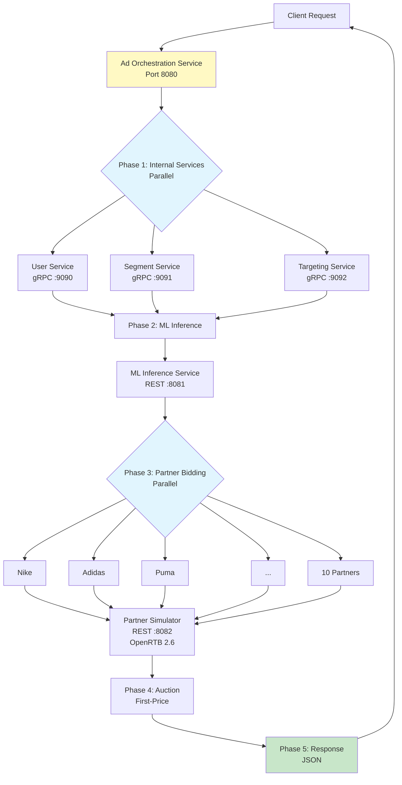
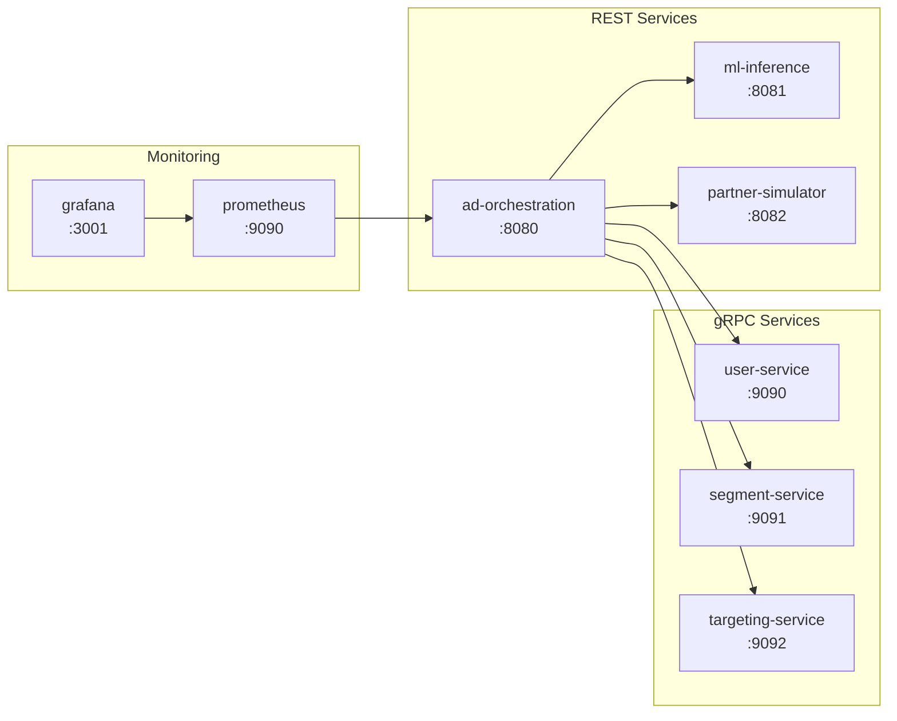

# AdServe - High-Performance Ad Serving Platform

Production-grade real-time bidding (RTB) platform demonstrating modern Java concurrency with Virtual Threads and StructuredTaskScope.

## Overview

AdServe demonstrates Java 25's Virtual Threads for efficient structured concurrency. The system orchestrates parallel service calls, real-time ML predictions, and demand partner bidding to serve targeted advertisements.

**Key Features:**
- **Concurrency:** Virtual Threads with StructuredTaskScope (Java 25 Preview)
- **Protocol:** OpenRTB 2.6 for partner communication
- **Observability:** Prometheus metrics and Grafana dashboards

## Architecture



## Request Flow

| Phase | Description | Implementation |
|-------|-------------|----------------|
| **1. Internal Services** | Fetch user profile, segments, and targeting rules | `StructuredTaskScope` with 3 parallel gRPC calls |
| **2. ML Prediction** | Predict CTR/CVR using request context | Sequential REST call |
| **3. Partner Bidding** | Call 10 demand partners using OpenRTB 2.6 | `StructuredTaskScope` with 10 parallel HTTP calls |
| **4. Auction** | Select highest bid (first-price auction) | In-memory comparison |
| **5. Response** | Return winning ad to client | JSON serialization |

## Technology Stack

| Component | Technology | Version | Purpose |
|-----------|------------|---------|---------|
| Language | Java | 25 | Virtual Threads, StructuredTaskScope (preview) |
| Framework | Spring Boot | 4.0.1 | REST API, dependency injection |
| Build Tool | Gradle | 8.x | Multi-module project management |
| Internal RPC | gRPC | 1.75.0 | High-performance service-to-service |
| Protocol Buffers | protobuf | 4.29.3 | Service contract definitions |
| RTB Protocol | OpenRTB | 2.6 | Industry standard bid request/response |
| Monitoring | Prometheus + Grafana | latest | Metrics and dashboards |

## Services



| Service | Port | Protocol | Description |
|---------|------|----------|-------------|
| ad-orchestration | 8080 | HTTP/REST | Main orchestrator, coordinates all service calls |
| user-service | 9090 | gRPC | User profile data |
| segment-service | 9091 | gRPC | Behavioral segments |
| targeting-service | 9092 | gRPC | Targeting rules |
| ml-inference | 8081 | HTTP/REST | CTR/CVR predictions (mock) |
| partner-simulator | 8082 | HTTP/REST | Simulates 10 demand partners with OpenRTB 2.6 |

## Quick Start

### Prerequisites

- Java 25
- Gradle 8.x
- Docker & Docker Compose (for full stack)

### Run with Docker Compose

```bash
# Build and start all services
docker-compose up --build

# Test the API
curl -X POST http://localhost:8080/api/v1/ads/request \
  -H "Content-Type: application/json" \
  -d '{"userId":"user-123","deviceType":"mobile","country":"USA"}'

# View Grafana dashboards
open http://localhost:3001  # admin/admin

# Stop all services
docker-compose down
```

### Run Locally

Start each service in a separate terminal:

```bash
# Terminal 1 - User Service
./gradlew :user-service:bootRun

# Terminal 2 - Segment Service
./gradlew :segment-service:bootRun

# Terminal 3 - Targeting Service
./gradlew :targeting-service:bootRun

# Terminal 4 - ML Inference
./gradlew :ml-inference:bootRun

# Terminal 5 - Partner Simulator
./gradlew :partner-simulator:bootRun

# Terminal 6 - Ad Orchestration
./gradlew :ad-orchestration:bootRun
```

### Test Request

```bash
curl -X POST http://localhost:8080/api/v1/ads/request \
  -H "Content-Type: application/json" \
  -d '{
    "userId": "user-123",
    "deviceType": "mobile",
    "country": "USA"
  }'
```

### Example Response

```json
{
  "requestId": "req-abc123",
  "traceId": "trace-xyz789",
  "status": "success",
  "ad": {
    "partnerId": "nike",
    "bidPrice": 2.50,
    "adId": "ad-12345",
    "adCreativeUrl": "https://partner.com/ad.jpg"
  },
  "processingTimeMs": 87,
  "metadata": {
    "internalServicesCalled": 3,
    "mlServiceCalled": true,
    "partnersCalled": 10,
    "bidsReceived": 8
  }
}
```

## Project Structure

```
adserve/
├── ad-orchestration/       # Main orchestrator (REST API)
├── user-service/           # gRPC - User profiles
├── segment-service/        # gRPC - Behavioral segments
├── targeting-service/      # gRPC - Targeting rules
├── ml-inference/           # REST - ML predictions
├── partner-simulator/      # REST - 10 mock DSPs
├── proto/                  # Protocol Buffer definitions
├── monitoring/
│   ├── prometheus/         # Prometheus configuration
│   └── grafana/            # Grafana dashboards
├── docker-compose.yml      # Container orchestration
├── build.gradle.kts        # Root Gradle configuration
└── settings.gradle.kts     # Multi-module settings
```

## Key Implementation Details

### Virtual Threads with StructuredTaskScope

The orchestrator uses `StructuredTaskScope` for structured parallel execution:

```java
try (var scope = StructuredTaskScope.open(
        StructuredTaskScope.Joiner.awaitAllSuccessfulOrThrow(),
        cf -> cf.withTimeout(Duration.ofMillis(deadlineMs)))) {

    // Fork parallel calls to internal services
    var userTask = scope.fork(() -> callUserService(userId));
    var segmentTask = scope.fork(() -> callSegmentService(userId));
    var targetingTask = scope.fork(() -> callTargetingService(userId));

    // Wait for all tasks to complete
    scope.join();

    // Get results
    var userResponse = userTask.get();
    var segmentResponse = segmentTask.get();
    var targetingResponse = targetingTask.get();
}
```

### Benefits of This Approach

| Feature | Benefit |
|---------|---------|
| **Virtual Threads** | Lightweight threads for efficient I/O, threads unmount during blocking operations |
| **StructuredTaskScope** | Clear parent-child relationships, automatic cleanup with try-with-resources |
| **Built-in Timeouts** | Configurable deadline enforcement (10ms for gRPC, 80ms for partners) |
| **Short-Circuiting** | Built-in cancellation when any subtask fails |

### Configuration

Key timeouts are configurable via `application.properties`:

```properties
# gRPC client deadline
grpc.client.deadline-ms=10

# Partner bidding timeout
http.client.partner.timeout-ms=80
```

## Development

### Build All Services

```bash
./gradlew build
```

### Run Tests

```bash
./gradlew test
```

### Generate gRPC Stubs

```bash
./gradlew generateProto
```

### Endpoints

| Endpoint | Method | Description |
|----------|--------|-------------|
| `/api/v1/ads/request` | POST | Serve ad request |
| `/actuator/health` | GET | Health check |
| `/actuator/prometheus` | GET | Prometheus metrics |

## Why This Stack?

### Virtual Threads Over Reactive

- **Simpler Code:** Sequential-looking blocking code
- **Better Debugging:** Standard stack traces
- **Easier Profiling:** JFR shows your methods directly
- **No Callback Hell:** No reactive operators to chain

### StructuredTaskScope Over CompletableFuture

- **Structured Concurrency:** Clear parent-child relationships
- **Automatic Cleanup:** try-with-resources ensures no leaks
- **Short-Circuiting:** Built-in cancellation policies
- **Standard Exception Handling:** No `CompletionException` unwrapping

### gRPC Over REST (Internal Services)

- **Performance:** Binary protocol, more efficient than JSON
- **Type Safety:** Compile-time contract verification
- **Code Generation:** Auto-generated stubs from `.proto` files
- **HTTP/2:** Multiplexing and header compression